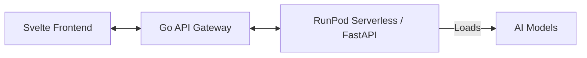

# Berne's Music Box Monorepo

This monorepo contains a set of projects for AI music generation and orchestration. It provides a complete pipeline from a user's prompt to a fully generated audio track with its corresponding multi-track MIDI extraction.

## Architecture

The system follows a tiered architecture designed for scalability and separation of concerns:

1.  **Frontend (UI)**: A modern, reactive web application built with **Svelte 5** and TypeScript. It allows users to enter prompts, monitor task status in real-time via polling, and download/preview generated assets.
2.  **API Gateway**: A high-performance orchestration layer written in **Go (Gin framework)**. It acts as the primary entry point for the UI, managing task persistence, queuing, and communication with the backend generation services.
3.  **Inference Backend (RunPod Serverless)**: A **Python-based FastAPI** application containerized for **RunPod Serverless**. It handles the heavy-lifting of AI music generation and MIDI transcription, utilizing GPU acceleration.



## AI Models

The project leverages state-of-the-art AI models for high-quality music production:

-   **HeartMuLa**: The core music generation model. It generates high-fidelity audio tracks based on text prompts, style tags, and duration requirements. It also supports stem generation (vocals, drums, bass, etc.).
-   **YourMT3+**: A powerful multi-task multitrack music transcription model used for high-fidelity MIDI extraction. It can transcribe complex audio into individual MIDI tracks with instrument information.
-   **Basic Pitch**: A lightweight, fast MIDI transcription model by Spotify, used as a robust alternative or default for simpler MIDI extraction tasks.

## Project Structure

-   `api-gateway/`: Go-based REST API orchestration layer. Manages tasks and polls the inference backend.
-   `runpod-serverless/`: Python Inference backend. Contains the logic for audio generation, MIDI transcription, and RunPod/FastAPI handlers. See [runpod-serverless/README.md](runpod-serverless/README.md) for more details.
-   `ui/`: Svelte 5 frontend for user interaction.

## Getting Started

### Prerequisites

-   Docker (for building the inference container)
-   Go 1.25+
-   Node.js & npm/pnpm/yarn
-   Python 3.10+
-   NVIDIA GPU (Recommended for local CUDA testing, or use RunPod)

### Installation

Refer to the README in each subdirectory for specific installation instructions.

### Orchestration

Use the root `Makefile` for common tasks:

```bash
make help          # Show available commands
make build         # Build all components (Gateway, UI, Docker image)
make run-gateway   # Run Go API Gateway
make run-runpod    # Run Inference Backend (local simulation)
make run-ui        # Run Svelte UI in dev mode
```

## License

MIT
